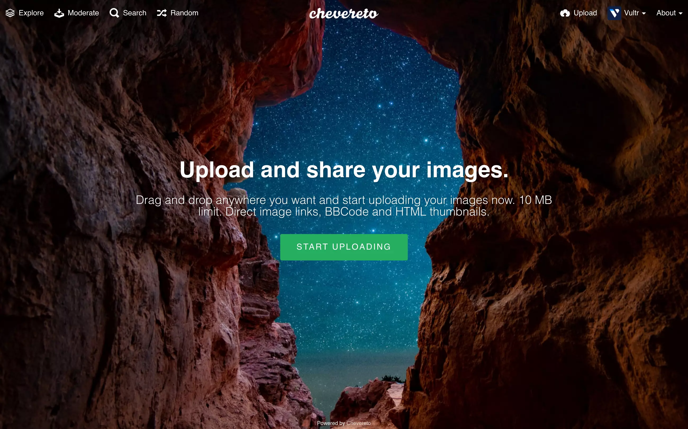
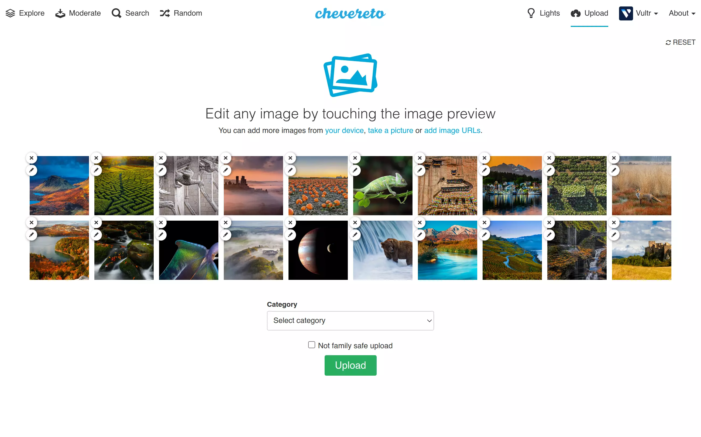
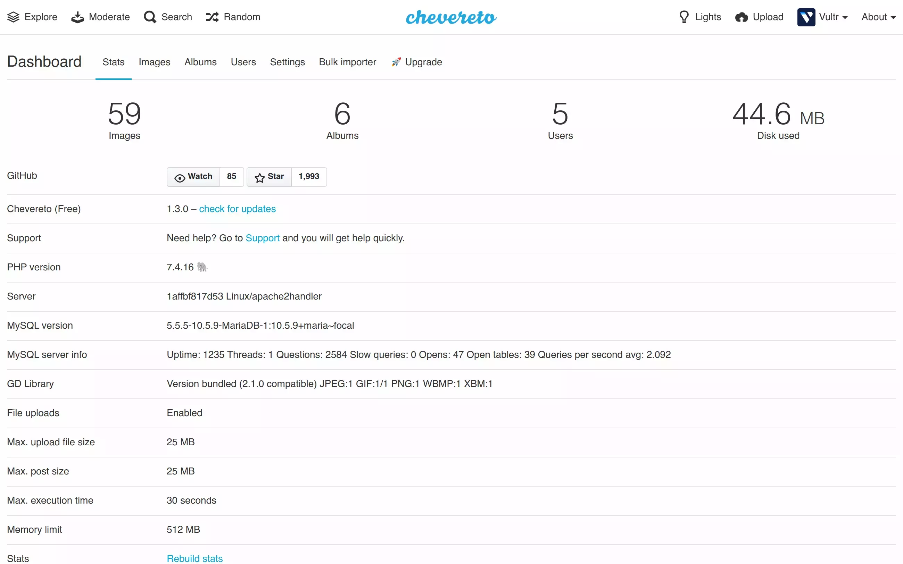

# Chevereto-Free

> 🔔 Subscribe to the [newsletter](https://newsletter.chevereto.com/subscription?f=PmL892XuTdfErVq763PCycJQrrnQgNmDybvvbXt7hbfEtgCJrjxKnBK4i9LmtXEOfM7MQBwP36vhsCGYOogbSIfBYw) to don't miss any update regarding Chevereto.

[Chevereto](https://chevereto.com) allows you to create a full-featured image hosting website on your own server. It's your hosting and your rules, say goodbye to closures and restrictions.

## Goodbye Chevereto-Free

We are deeply sorry to inform that **we will stop maintaining Chevereto-Free on 2021-12-31** and we won't produce any more releases for it. We are very sad for doing this, but kindly note that we are just a small 2-person team from Chile and we can't afford to gift this edition any longer. We are now focused exclusively in our [paid edition](https://chevereto.com/pricing), **thanks for your support**.

Four long years we tried to make this feasible, it just didn't worked for us. Many thanks for using our software! Hope you enjoyed the experience.

## About this fork

Chevereto-Free is a fork of [Chevereto V3.16](https://releases.chevereto.com/3.X/3.16/3.16.0.html) in which only basic features are preserved. 👉 **This fork removes**:

- Social network login
- External Storage servers
- User likes and following
- Manage banners

Chevereto-Free **is not an accurate representation** of our most updated software. It is just a small sample of our software old as `2020-09-03`. ⚠ **This fork misses**:

- All security and bug patches since `2020-09-03`
- Native support for containers
- User interface upgrade
- CLI API
- Support for ImageMagick
- Installer support

## Installation

Get the target [release](https://github.com/chevereto/Chevereto-Free/releases) you want. Don't install this from any branch unless you want to use it for development purposes.

## Support

Chevereto-Free doesn't include any support neither any supporting service is offered for this edition which will be discontinued on **2021-12-31**.

## License

Copyright [Rodolfo Berríos Arce](http://rodolfoberrios.com) - Released under the [MIT License](LICENSE).
