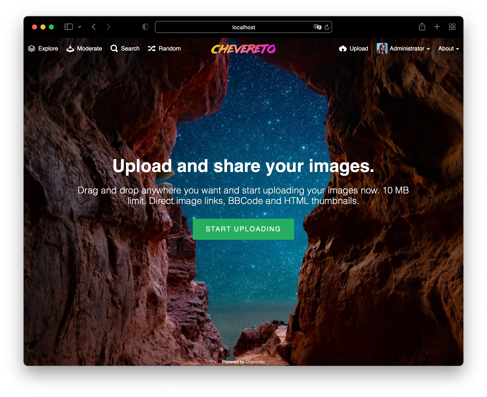
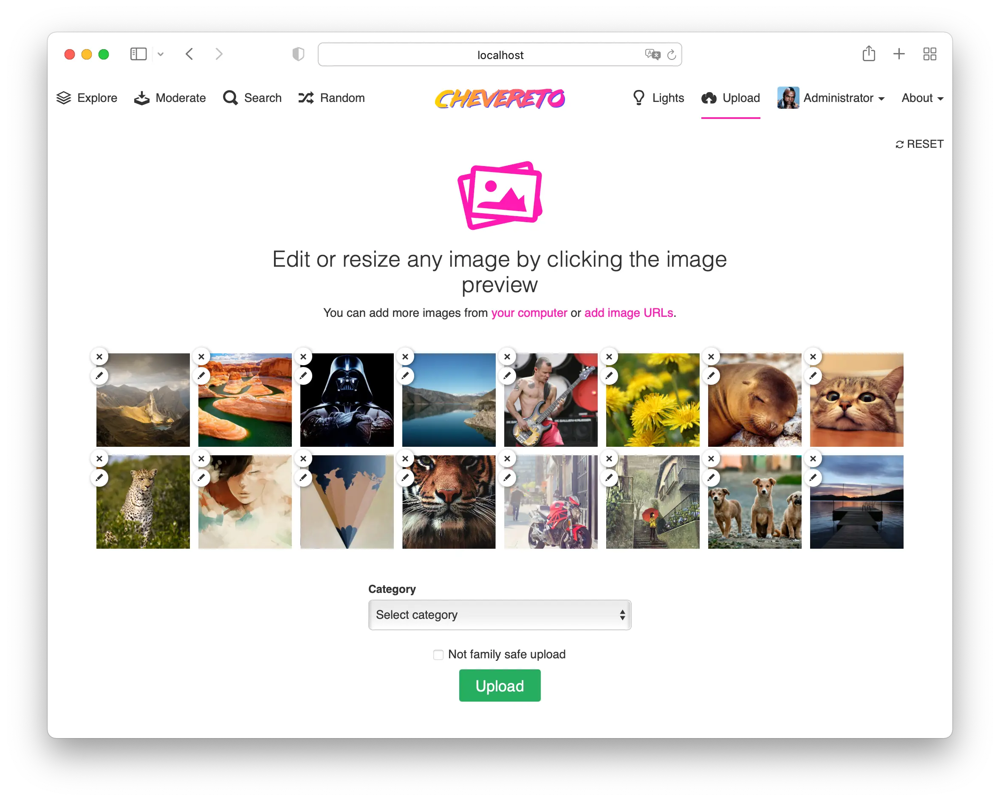
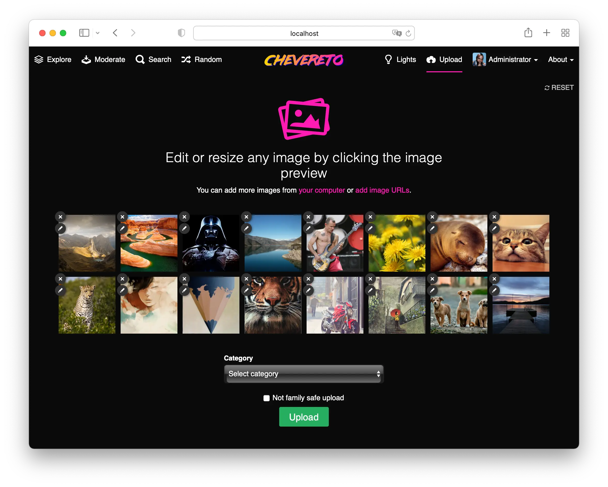
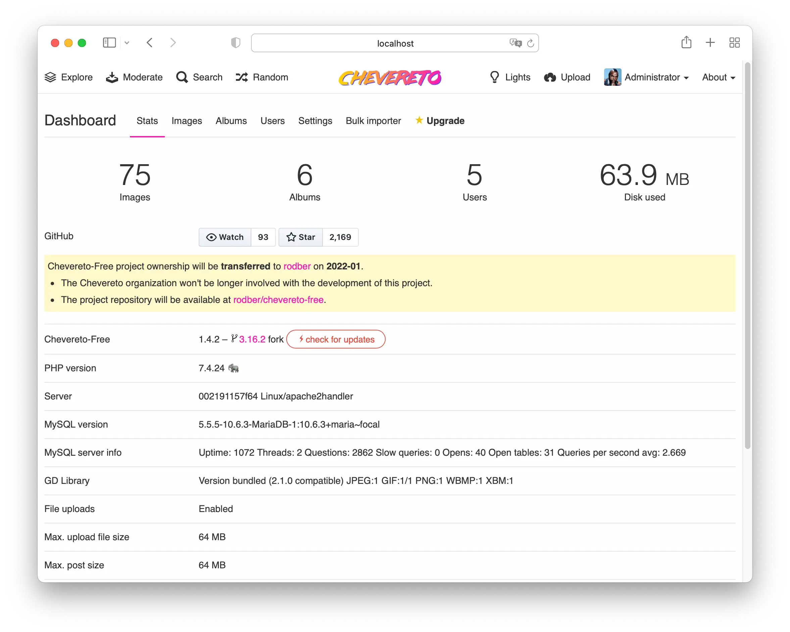

# Chevereto-Free


Chevereto-Free allows you to create a full-featured image hosting website on your own server. It's your hosting and your rules, say goodbye to closures and restrictions.

## Project status

Starting on **2021-10** the [Chevereto](https://chevereto.com) organization won't be in charge of this project and the repo ownership will be transferred to [@rodber](https://github.com/rodber).

## Screens










## About this fork

Chevereto-Free is forked from [Chevereto V3.16.2](https://releases.chevereto.com/3.X/3.16/3.16.2.html) in which only basic features are preserved. This fork was created for personal usage and small communities.

👉 **This fork removes**

* Social Network Login
* External Storage Servers
* Likes and Followers
* Manage Banners
* Multi-language Support
* Moderation
* Bulk Content Importing

👉 **This fork misses**

* [Installer](https://github.com/chevereto/installer) tooling
* All non-security updates added in [V3.17](https://releases.chevereto.com/3.X/3.17/3.17.2.html), [V3.18](https://releases.chevereto.com/3.X/3.18/3.18.3.html) and [V3.20](https://releases.chevereto.com/3.X/3.20/3.20.12.html) including:
  * 360 images
  * Nested albums
  * ImageMagick support
  * Improved sharing options
  * User interface upgrade
  * 12FA Support
  * CLI API

## Installation

### Requirements

* PHP 7.4
* MySQL 5.7 / 8 - MariaDB 10
* Apache HTTP Web Server
  * mod_rewrite

## Composer-based installation

* Requires [Composer](https://getcomposer.org)

```sh
composer create-project rodber/chevereto-free . \
    --repository='{
        "url": "https://github.com/rodber/chevereto-free.git",
        "type": "vcs"
    }' \
    --remove-vcs \
    --ignore-platform-reqs
```

## Manual installation

* Pick the [latest release](https://github.com/rodber/chevereto-free/releases/latest)
* Download the tagged `$TAG.zip` release artifact
* Unzip the release in your target `public` web-server directory

## Updating

### HTTP self-update

* Go to `/dashboard`
* Click on "Check for updates"
* Follow the on-screen process

### Manual update

See [Manual Installation](#manual-installation)

## License

Copyright [Rodolfo Berríos Arce](http://rodolfoberrios.com) - [AGPLv3](LICENSE).
